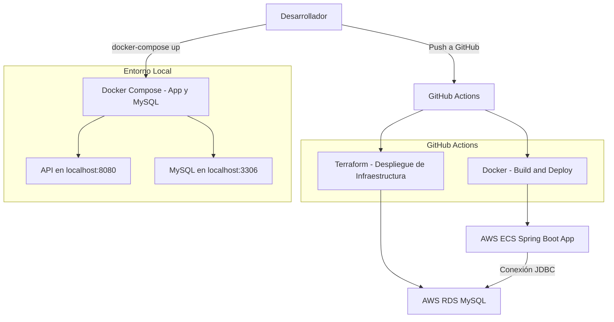

# Prueba Técnica Franquicias

## 📋 Descripción

Se requiere construir un API para manejar una lista de franquicias. Una franquicia se compone por un nombre y un listado de sucursales y, a su vez, una sucursal está  compuesta por un nombre y un listado de productos ofertados en la sucursal. Un producto se componente de un nombre y una cantidad de stock.

## Estructura del Proyecto

   ```bash
   ├── Dockerfile
   ├── compose.yaml
   ├── wait-for-mysql.sh
   ├── infra/
   │ ├── main.tf
   │ ├── variables.tf
   │ ├── outputs.tf
   │ └── terraform.tfvars
   ├── .github/
   │ └── workflows/
   │ ├── deploy-infra.yml
   │ └── deploy-app.yml
   └── README.md
   ```

## Despliegue Local

### Requisitos Previos

- Docker
- Docker Compose

### Pasos

1. Clonar el repositorio:

   ```bash
   git clone https://github.com/tu_usuario/nequi.git
   cd nequi
   
2. Construir y levantar los contenedores:

   ```bash
    docker-compose up --build
    
   Esto iniciará la base de datos MySQL y la aplicación Spring Boot en los puertos 3306 y 8080 respectivamente.

3. Acceder a la API:

    ```bash
    docker-compose up --build

4. Acceder al swagger:
   ```bash
   http://localhost:8080/swagger-ui/index.html#/

## Despliegue en AWS

### Requisitos Previos
- Cuenta de AWS
- AWS CLI configurado
- Terraform instalado

### Pasos
1. Navegar al directorio de infraestructura:

   ```bash
   cd infra

2. Inicializar Terraform:
   ```bash
   terraform init

3. Visualizar cambios de infraestructura
   ```bash
   terraform plan -input=false

4. Aplicar la configuración:
   ```bash
   terraform apply -auto-approve -input=false

## Automatización con GitHub Actions

Este proyecto incluye dos workflows de GitHub Actions:

- deploy-infra.yml: Aprovisiona la infraestructura en AWS utilizando Terraform.
- deploy-app.yml: Construye y despliega la aplicación en AWS ECS.

Los workflows se activan automáticamente al realizar cambios en los directorios correspondientes.

## Diagrama de Arquitectura

A continuación, se describe el diagrama de arquitectura del proyecto:

